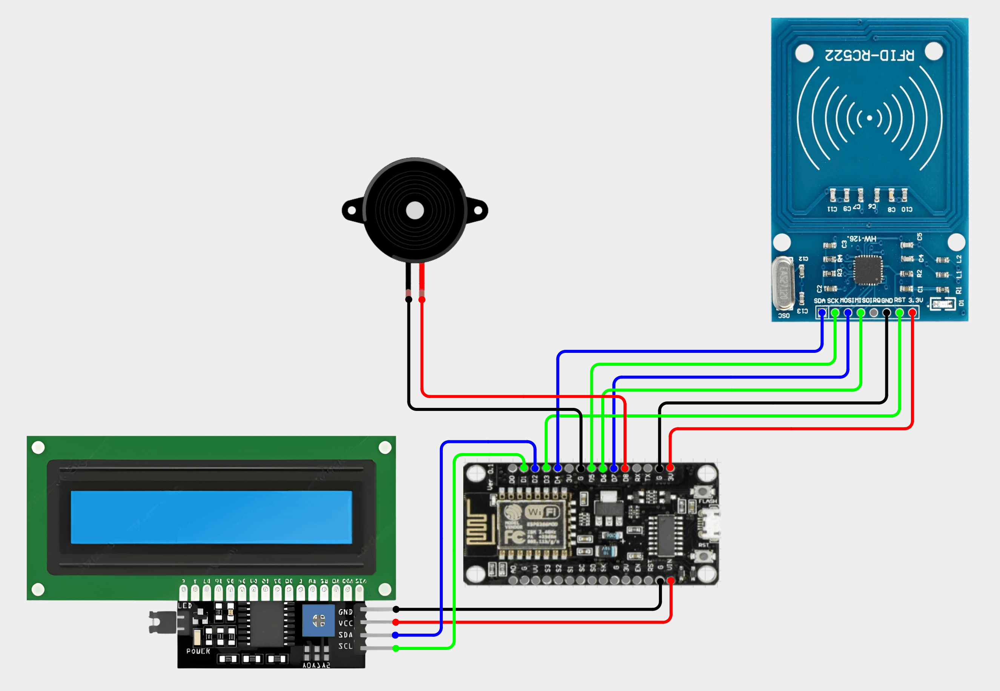
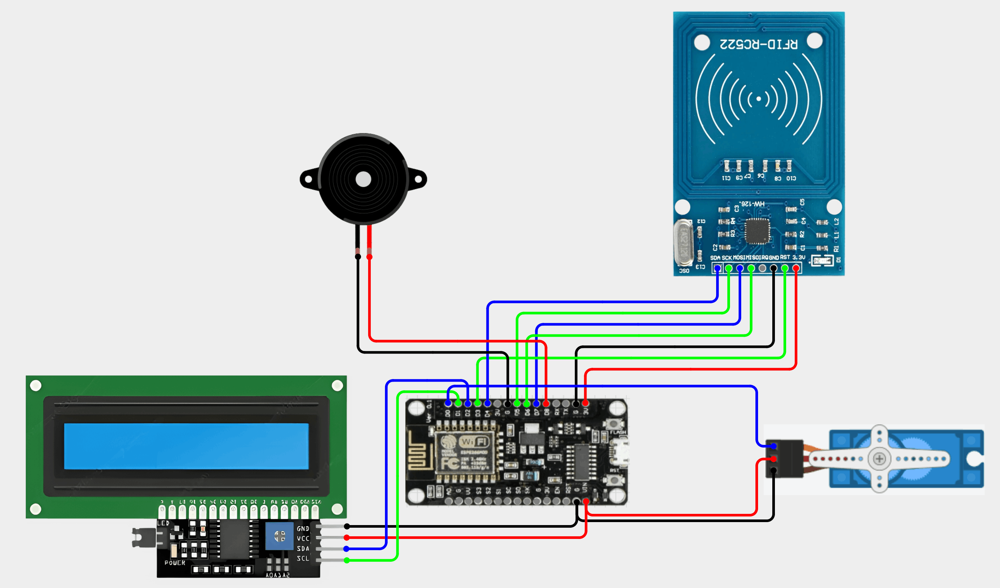
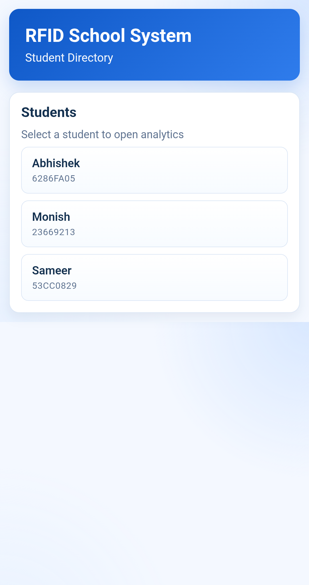
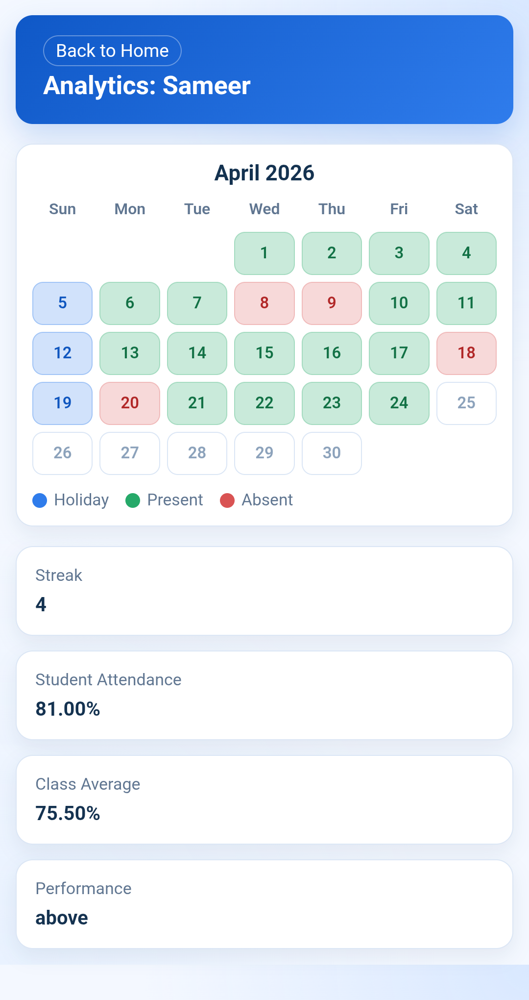
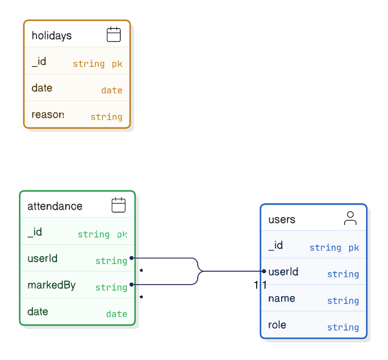

# RFID School System

RFID School System is a full-stack school attendance and access control solution built with two dedicated ESP8266 boards, a Node.js backend, and a browser-based dashboard. One board manages attendance collection through teacher and student RFID card taps, while the other board controls restricted access for teachers through RFID-based role verification and a servo gate. The web application provides student listing and analytics, including attendance calendar, streak, performance, and class comparison metrics.

---

## Table of Contents

- [Project Overview](#project-overview)
- [General Flow and Logic](#general-flow-and-logic)
- [Tech Stack](#tech-stack)
- [Application Setup](#application-setup)
- [Embedded Setup](#embedded-setup)
- [API Reference](#api-reference)
- [Connections](#connections)
- [Circuit Diagrams](#circuit-diagrams)
- [Frontend UI](#frontend-ui)
- [Database Design](#database-design)
- [Project Structure](#project-structure)

---

## Project Overview

This repository contains three major parts:

- Application backend and frontend in the `application` folder.
- Embedded firmware for two separate ESP8266 boards in the `embedded` folder:
    - Attendance board firmware.
    - Access control board firmware.
- Project assets and diagrams in the `images` folder.

Both embedded boards communicate with the same backend API.

---

## General Flow and Logic

### Attendance Board Flow

1. Board boots and connects to Wi-Fi.
2. Board fetches teacher IDs and reset card ID from backend.
3. Teacher taps card to start attendance queue.
4. Students tap cards to get added to queue.
5. Teacher taps again to submit attendance for all queued students.
6. Optional reset card tap clears attendance records for the current day.

### Access Control Board Flow

1. Board boots and connects to Wi-Fi.
2. User taps card on RFID reader.
3. Board calls role API for that user ID.
4. If role is `teacher`, access is granted and servo opens.
5. If role is not `teacher` or user is unknown, access is denied.

### Web Frontend Flow

1. Home page loads all students.
2. User selects a student.
3. Student page calls analytics API.
4. UI renders monthly attendance calendar and summary stats.

---

## Tech Stack

### Backend

- Node.js
- Express.js
- MongoDB
- Mongoose

### Frontend

- HTML
- CSS
- JavaScript

### IoT Hardware

- ESP8266 Microcontroller
- MFRC522 RFID Reader
- I2C LCD Display
- Buzzer
- SG90 Servo Motor (access control setup only)
- Breadboard and jumper wires

### IoT Software

- PlatformIO
- Arduino framework for ESP8266

---

## Application Setup

### 1) Clone Repository

```bash
git clone https://github.com/sameerbhagtani/rfid-school-system
cd rfid-school-system
```

### 2) Setup Backend and Frontend Application

```bash
cd application
npm i
```

Copy `.env.example` to `.env`, then fill all required environment variables.

Run database and seed data:

```bash
npm run db:up
npm run db:seed
```

Start application server:

```bash
npm run dev
```

Default application URL:

- `http://localhost:3000`

---

## Embedded Setup

### 1) Configure Build Overrides

Inside `embedded`, copy:

- `platformio_override.example.ini` to `platformio_override.ini`

Then set all required values in `platformio_override.ini`.

Typical values include:

- `API_BASE_URL`
- `DEVICE_API_KEY` (required for attendance board)

### 2) Flash Attendance Board

```bash
cd embedded
pio run -e attendance -t upload
```

### 3) Flash Access Control Board

```bash
cd embedded
pio run -e access_control -t upload
```

### 4) Wi-Fi Provisioning

AP mode is already integrated through WiFiManager in both firmware builds.

---

## API Reference

Base URL examples:

- Local: `http://localhost:3000`

Response format:

- Success: `{ "success": true, ... }`
- Error: `{ "success": false, "message": "..." }`

### Authentication

`x-api-key` header is required only for attendance write routes:

- `POST /api/attendances`
- `DELETE /api/attendances/today`

### 1) Health Check

#### GET /api/ping

Response:

```json
{
    "success": true,
    "message": "All good!"
}
```

### 2) Users

#### GET /api/users/students

Response:

```json
{
    "success": true,
    "data": [
        {
            "userId": "53CC0829",
            "name": "Sameer"
        }
    ]
}
```

#### GET /api/users/teachers/ids

Response:

```json
{
    "success": true,
    "data": ["A3517729", "5D497406"]
}
```

#### GET /api/users/reset/id

Response:

```json
{
    "success": true,
    "data": {
        "id": "4340F113"
    }
}
```

#### GET /api/users/:userId/role

Path params:

- `userId` (8-character RFID UID)

Response:

```json
{
    "success": true,
    "data": {
        "role": "teacher",
        "name": "Seema ma'am"
    }
}
```

Possible errors:

- `400` Invalid User ID
- `404` User not found

#### GET /api/users/students/:studentId/analytics

Path params:

- `studentId` (8-character RFID UID)

Response:

```json
{
    "success": true,
    "data": {
        "name": "Sameer",
        "streak": 3,
        "studentPercent": "85.7",
        "classAvgPercent": "79.2",
        "performance": "above",
        "attendanceDates": ["2026-04-01", "2026-04-02"],
        "holidayDates": ["2026-04-05", "2026-04-12"]
    }
}
```

Possible errors:

- `400` Invalid Student ID
- `404` Student not found

### 3) Attendance

#### POST /api/attendances

Headers:

- `Content-Type: application/json`
- `x-api-key: <DEVICE_API_KEY>`

Request body:

```json
{
    "markedBy": "A3517729",
    "studentIds": ["53CC0829", "6286FA05", "23669213"]
}
```

Validation rules:

- `markedBy` must be a non-empty string
- `studentIds` must be a non-empty string array
- IDs are normalized to uppercase by backend
- Attendance marking is blocked on holidays
- Duplicate attendance for same student and date is ignored safely

Response:

```json
{
    "success": true,
    "message": "Attendance Marked. Students : 3"
}
```

Possible errors:

- `400` Invalid payload
- `400` Holiday restriction
- `400` No valid student IDs provided
- `401` Unauthorized (missing or invalid API key)
- `404` Teacher not found

#### DELETE /api/attendances/today

Headers:

- `x-api-key: <DEVICE_API_KEY>`

Response:

```json
{
    "success": true,
    "message": "Removed 3 records."
}
```

Possible errors:

- `401` Unauthorized (missing or invalid API key)

---

## Connections

- Buzzer

| Wire  | ESP Pin |
| ----- | ------- |
| Black | GND     |
| Red   | D8      |

- LCD

| LCD Pin | ESP Pin |
| ------- | ------- |
| GND     | GND     |
| VCC     | VIN     |
| SDA     | D2      |
| SCL     | D1      |

- RFID Reader

| Reader Pin | ESP Pin |
| ---------- | ------- |
| GND        | GND     |
| 3.3V       | 3V      |
| SCK        | D5      |
| MOSI       | D7      |
| MISO       | D6      |
| RST        | D3      |
| SDA        | D4      |

- Servo Motor (Only in Access Control)

| Wire   | ESP Pin |
| ------ | ------- |
| Brown  | GND     |
| Red    | VIN     |
| Orange | D0      |

---

## Circuit Diagrams

### Attendance Module



### Access Control Module



---

## Frontend UI

### Home UI (Student Directory)



### Analytics UI (Calendar and Stats)



---

## Database Design



Data model summary:

- `User`: stores RFID UID, name, and role (`student`, `teacher`, `reset`)
- `Attendance`: stores `(user, date, markedBy)` and enforces one record per student per day
- `Holiday`: stores blocked attendance dates with reason

---

## Project Structure

```text
rfid-school-system/
├── application/
│   ├── public/           # Frontend assets (HTML, CSS, JS)
│   └── src/              # Backend (Express, Mongoose, routes, controllers)
├── embedded/
│   ├── src/              # Firmware entry points for each board
│   └── lib/Common/src/   # Shared hardware helper modules
└── images/               # Circuit diagrams, UI screenshots, ER diagram
```
